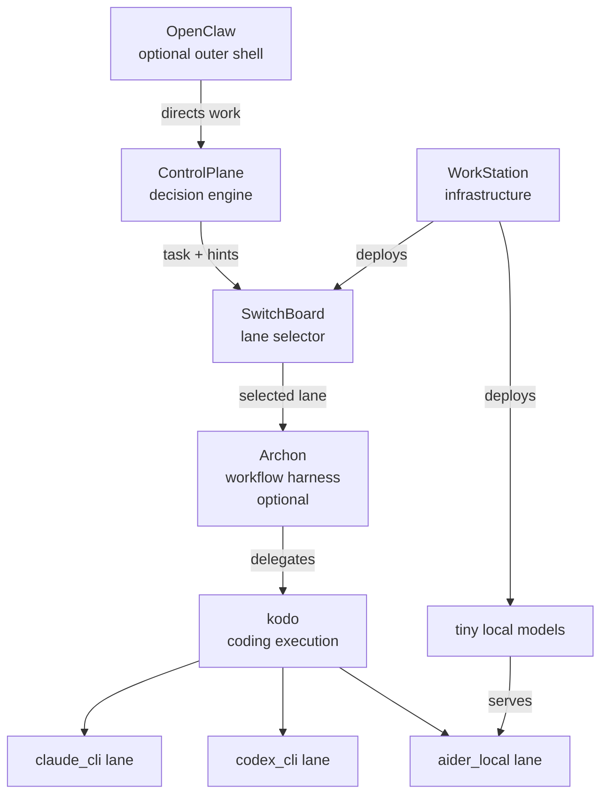

# System Architecture Overview

This document is the authoritative top-level description of the platform. It supersedes
the service-centric architecture descriptions in individual repo docs wherever they
conflict with what is written here.

---

## The Stack in One Sentence

ControlPlane decides what work matters next, SwitchBoard selects the execution lane,
Archon enforces workflow discipline, kodo performs the coding, and WorkStation keeps
the local infrastructure running.

---

## Components and Roles

| Component | Role |
|-----------|------|
| **WorkStation** | Local infrastructure platform. Runs the services, owns Dockerfiles, compose manifests, lifecycle scripts, and tiny local model deployment. |
| **SwitchBoard** | Execution-lane selector. Evaluates a declarative policy and routes each task to the appropriate coding lane. |
| **ControlPlane** | Decision engine. Observes repos, generates insights, proposes work, and drives the autonomy loop. |
| **Archon** | Workflow harness. Imposes structured, reproducible execution steps on top of a coding backend. |
| **kodo** | Coding execution backend. Orchestrates a multi-agent coding session using Claude Agent SDK or Codex SDK. |
| **OpenClaw** | Optional outer operator shell. Provides a human-facing runtime above ControlPlane. Not required for the system to function. |
| **Claude CLI lane** | Premium execution lane. Runs Claude Code CLI under OAuth/subscription billing. |
| **Codex CLI lane** | Premium execution lane. Runs Codex CLI under OpenAI subscription billing. |
| **aider local lane** | Cheap execution lane. Runs Aider against WorkStation-deployed tiny models. No external API calls. |

---

## What Was Removed

`9router` is no longer part of this architecture. See
[`adr/0001-remove-9router.md`](adr/0001-remove-9router.md) for the full rationale.
In summary: the system has moved to CLI-based execution lanes that manage their own
auth via OAuth/subscription; a provider-credential proxy is no longer needed or
appropriate.

---

## Layered View

```
┌─────────────────────────────────────────────────────────────┐
│  OpenClaw  (optional outer operator shell)                  │
└──────────────────────────┬──────────────────────────────────┘
                           │ directs work
                           ▼
┌─────────────────────────────────────────────────────────────┐
│  ControlPlane  (decision engine)                            │
│                                                             │
│  observe → analyze → decide → propose                       │
└──────────────────────────┬──────────────────────────────────┘
                           │ task + lane hint
                           ▼
┌─────────────────────────────────────────────────────────────┐
│  SwitchBoard  (execution-lane selector)                     │
│                                                             │
│  classify → score → select lane                             │
└──────────────────────────┬──────────────────────────────────┘
                           │ selected lane
                           ▼
┌─────────────────────────────────────────────────────────────┐
│  Archon  (workflow harness)  [optional]                     │
│                                                             │
│  load YAML workflow → execute DAG nodes                     │
└──────────────────────────┬──────────────────────────────────┘
                           │ delegates execution
                           ▼
┌─────────────────────────────────────────────────────────────┐
│  kodo  (coding execution backend)                           │
│                                                             │
│  spawn agent → iterate → validate → write artifacts         │
└──────────────┬─────────────────────┬───────────────────────┘
               │                     │                    │
               ▼                     ▼                    ▼
        claude_cli             codex_cli            aider_local
        (Claude Code CLI)      (Codex CLI)          (Aider + tiny models)
        OAuth / subscription   OAuth / subscription  WorkStation-deployed
```

```
WorkStation
├── deploys: SwitchBoard container
├── deploys: tiny local models for aider_local lane
├── manages: Plane infrastructure (ControlPlane dependency)
└── provides: lifecycle scripts, health checks, port assignments
```

---

## Happy-Path Conceptual Flow

1. **ControlPlane** observes the repo state, derives insights, and decides that a
   specific improvement task is worth doing. It emits a task proposal.

2. The proposal reaches **SwitchBoard**. SwitchBoard evaluates the task properties
   (complexity, cost sensitivity, urgency) against its policy and selects an execution
   lane — for example, `claude_cli` for a complex refactor or `aider_local` for a
   cheap lint fix.

3. **Archon** (if present) wraps the execution in a YAML-defined workflow: plan →
   implement → validate → PR. Each node runs in sequence or parallel per the DAG.

4. **kodo** performs the actual coding execution within each Archon node (or directly
   if Archon is absent). It spawns a Claude Code session or Codex session, iterates
   until the task is done, and writes structured artifacts.

5. The lane runner (**Claude CLI**, **Codex CLI**, or **Aider**) is the process that
   actually edits files. It operates in a git worktree and exits when done.

6. Artifacts (diff, validation results, outcome summary) are written back to
   **ControlPlane** and — if configured — pushed as a PR and transitioned in Plane.

---

## Text Diagram: Invocation Hierarchy

```
OpenClaw
  → ControlPlane
    → SwitchBoard
      → Archon (optional)
        → kodo or direct lane runner
          → Claude CLI / Codex CLI / aider local
```

---

## Mermaid Diagram



---

## Why the Architecture Is Split This Way

**Strategy and execution are separated.** ControlPlane decides *what* to do; it does
not know or care which model runs the task. SwitchBoard decides *how* to run it; it
does not know or care about long-range task strategy.

**Lane selection is policy-driven, not hardcoded.** Changing cost/quality tradeoffs
is a SwitchBoard config edit, not a ControlPlane code change.

**Workflow discipline is optional but composable.** Archon can be inserted between
SwitchBoard and kodo to impose multi-step process on complex tasks. Simple tasks can
skip Archon entirely and go straight to kodo.

**Infrastructure ownership is centralised.** WorkStation is the single place where
services run or fail to run. No service repo needs to know how it is deployed.

**Local cheap execution is first-class.** The `aider_local` lane with WorkStation-
deployed tiny models means ControlPlane can generate useful work indefinitely without
incurring API costs on every run.

---

## Architecture Decisions

These decisions are stable. Later phases must not reopen them without explicit
evidence and a new ADR.

### Decision A — Adapter-first integration

External execution systems (kodo, Archon, OpenClaw) are integrated through adapters.
The platform owns canonical contracts: `TaskProposal`, `ExecutionRequest`,
`ExecutionResult`. Backend-native schemas do not define platform architecture. When a
backend's API changes, only the adapter changes — upstream contracts stay stable.

### Decision B — kodo is the first backend integration target

kodo is the first execution backend to integrate in full. It has the cleanest
headless/programmatic integration path via Claude Agent SDK and Codex SDK. This is
an implementation-order decision, not a declaration that kodo owns the architecture.
Other backends (Archon for workflow-wrapped executions, future backends) integrate
through the same adapter boundary.

### Decision C — Archon is optional and bounded

Archon is a useful workflow harness for complex, multi-step executions. It is
**not** the universal home for all execution lanes. Specifically:

- `aider_local` lane execution remains owned by WorkStation (model deployment) and
  kodo (execution); it does not require or go through Archon.
- ControlPlane can invoke kodo directly without Archon when workflow discipline is
  not needed.
- Archon is useful for `claude_cli` and `codex_cli` lanes when a YAML-defined
  plan → implement → validate → PR sequence is needed.

### Decision D — OpenClaw is later and optional

OpenClaw may become an outer operator shell and/or a later integration target. It is
not required for the initial happy path and should not drive early architectural
decisions. The system (ControlPlane through kodo) must function without OpenClaw.

### Decision E — No early upstream modifications

Forking or patching Archon, OpenClaw, or kodo upstream is out of scope for Phase 1
through Phase 5. All integration is done through adapter layers. Upstream
modification is a later, evidence-based decision that requires a new ADR. If a
backend's public API is insufficient, the correct response is to raise the gap, not
to fork the backend.

### Decision F — Upstream patching is evaluated from retained evidence

Even after adapter-first integration is established, upstream modifications remain
late, bounded, and reviewable. Recurring friction must be evaluated from retained
execution evidence, support-check failures, tuning findings, and adapter pain
before a patch proposal is considered. A proposal is not the same thing as an
accepted roadmap item.

---

## Sequence Example: Lint Fix Task

```
ControlPlane
  observe_repo() → lint_errors detected
  decide()       → emit lint_fix proposal, confidence=0.85

SwitchBoard
  classify(task) → complexity=low, cost_sensitivity=high
  select_lane()  → aider_local  (cheap, no API key needed)

kodo (aider_local lane)
  checkout worktree
  run aider with WorkStation tiny model
  fix lint errors
  run validation
  write diff + outcome artifacts

ControlPlane
  read artifacts
  propose PR
  transition Plane task → In Review
```

---

## Frequently Asked Questions

**Q: Does the system require OpenClaw?**
No. OpenClaw is an optional outer shell for human operators. ControlPlane runs
autonomously without it.

**Q: Does every task go through Archon?**
No. Archon is optional. kodo can be invoked directly. Archon adds structured DAG
execution for multi-step workflows.

**Q: Where does model routing happen?**
SwitchBoard. It selects the execution lane. It does not proxy API calls to external
providers.

**Q: Where do local models run?**
WorkStation deploys and serves the tiny local models consumed by the `aider_local`
lane. ControlPlane and SwitchBoard do not own model deployment.

**Q: Can kodo use a lane other than Claude CLI?**
Yes. kodo supports Claude Agent SDK (Claude CLI lane) and Codex SDK (Codex CLI lane).
Aider operates separately in the `aider_local` lane.

**Q: What happened to 9router?**
Removed. See [`adr/0001-remove-9router.md`](adr/0001-remove-9router.md).
