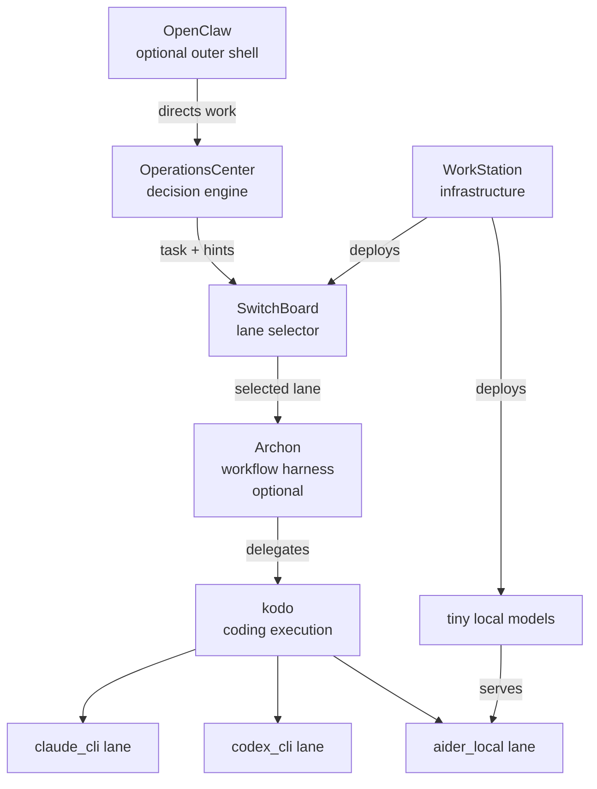

# System Architecture Overview

This document is the authoritative top-level description of the platform. It supersedes
the service-centric architecture descriptions in individual repo docs wherever they
conflict with what is written here.

---

## The Stack in One Sentence

OperationsCenter proposes work, SwitchBoard selects the lane and backend,
OperationsCenter's execution boundary enforces policy and dispatches adapters,
Observability records, Tuning recommends improvements, and WorkStation keeps
the local infrastructure running.

---

## Components and Roles

| Component | Role |
|-----------|------|
| **WorkStation** | Local infrastructure platform. Runs the services, owns Dockerfiles, compose manifests, lifecycle scripts, and tiny local model deployment. |
| **SwitchBoard** | Execution-lane selector. Evaluates a declarative policy and routes each task to the appropriate coding lane. |
| **OperationsCenter** | Decision and execution engine. Observes repos, generates insights, proposes work, consumes routing, enforces policy, dispatches backend adapters, and drives the autonomy loop. |
| **Policy** | Pre-execution guardrail layer. Evaluates canonical proposals and routing decisions, then allows, warns, requires review, or blocks. |
| **Observability** | Retention layer for canonical execution outcomes, artifacts, and normalized traces. |
| **Tuning** | Evidence-driven recommendation layer. Reads retained outcomes and proposes bounded improvements without silently mutating live policy. |
| **Archon** | Workflow harness. Imposes structured, reproducible execution steps on top of a coding backend. |
| **kodo** | Coding execution backend. Orchestrates a multi-agent coding session using Claude Agent SDK or Codex SDK. |
| **OpenClaw** | Optional outer operator shell. Provides a human-facing runtime above OperationsCenter. Not required for the system to function. |
| **Claude CLI lane** | Premium execution lane. Runs Claude Code CLI under OAuth/subscription billing. |
| **Codex CLI lane** | Premium execution lane. Runs Codex CLI under OpenAI subscription billing. |
| **aider local lane** | Cheap execution lane. Runs Aider against WorkStation-deployed tiny models. No external API calls. |

---

## Layered View

```
┌─────────────────────────────────────────────────────────────┐
│  OpenClaw  (optional outer operator shell)                  │
└──────────────────────────┬──────────────────────────────────┘
                           │ directs work
                           ▼
┌─────────────────────────────────────────────────────────────┐
│  OperationsCenter  (decision engine)                            │
│                                                             │
│  observe → analyze → decide → propose                       │
└──────────────────────────┬──────────────────────────────────┘
                           │ TaskProposal
                           ▼
┌─────────────────────────────────────────────────────────────┐
│  SwitchBoard  (execution-lane selector)                     │
│                                                             │
│  classify → score → select lane                             │
└──────────────────────────┬──────────────────────────────────┘
                           │ TaskProposal + LaneDecision
                           ▼
┌─────────────────────────────────────────────────────────────┐
│  OperationsCenter execution boundary                            │
│                                                             │
│  build ExecutionRequest → policy gate → adapter dispatch    │
└──────────────┬─────────────────────┬───────────────────────┘
               │                     │                    │
               ▼                     ▼                    ▼
        claude_cli             codex_cli            aider_local
        (Claude Code CLI)      (Codex CLI)          (Aider + tiny models)
        OAuth / subscription   OAuth / subscription  WorkStation-deployed
```

```
OperationsCenter observability + tuning
├── records: canonical ExecutionResult / ExecutionRecord evidence
└── recommends: bounded reviewable tuning changes

WorkStation
├── deploys: SwitchBoard container
├── deploys: tiny local models for aider_local lane
├── manages: Plane infrastructure (OperationsCenter dependency)
└── provides: lifecycle scripts, health checks, port assignments
```

---

## Happy-Path Conceptual Flow

1. **OperationsCenter** observes the repo state, derives insights, and decides that a
   specific improvement task is worth doing. It emits a canonical `TaskProposal`.

2. The proposal reaches **SwitchBoard**. SwitchBoard evaluates the task properties
   (complexity, cost sensitivity, urgency) against its policy and selects an execution
   lane/backend pair — for example, `claude_cli` for a complex refactor or
   `aider_local` for a cheap lint fix.

3. **OperationsCenter's execution boundary** builds a canonical `ExecutionRequest`
   from the proposal, routing decision, and runtime workspace context.

4. **Policy** evaluates the proposal and routing decision before adapter
   invocation. Unsafe work is blocked, sensitive work is gated for review, and
   only allowed runs proceed.

5. OperationsCenter dispatches the selected bounded adapter. **Archon** may wrap
   the execution in a YAML-defined workflow; **kodo** or another adapter
   performs the actual coding work.

6. The lane process (**Claude CLI**, **Codex CLI**, or **Aider**) is the process that
   actually edits files. It operates in a git worktree and exits when done.

7. **Observability** retains the canonical outcome, normalized artifacts, and trace
   data for both executed and policy-blocked runs.

8. **Tuning** reads retained evidence and produces bounded, reviewable improvement
   recommendations. It does not silently rewrite live routing or autonomy policy.

8. Artifacts (diff, validation results, outcome summary) are written back to
   **OperationsCenter** and — if configured — pushed as a PR and transitioned in Plane.

---

## Text Diagram: Invocation Hierarchy

```
OpenClaw
  → OperationsCenter
    → SwitchBoard
    → Policy
    → adapter-backed execution
      → Claude CLI / Codex CLI / aider local
    → Observability
    → Tuning
```

---

## Mermaid Diagram



---

## Why the Architecture Is Split This Way

**Strategy and execution are cleanly separated inside one boundary.**
OperationsCenter decides *what* to do and owns the policy-gated handoff into
execution. SwitchBoard decides *how* to run it; it does not know or care about
long-range task strategy.

**Lane selection is policy-driven, not hardcoded.** Changing cost/quality tradeoffs
is a SwitchBoard config edit, not a OperationsCenter code change.

**Workflow discipline is optional but composable.** Archon can be inserted between
SwitchBoard and kodo to impose multi-step process on complex tasks. Simple tasks can
skip Archon entirely and go straight to kodo.

**Infrastructure ownership is centralised.** WorkStation is the single place where
services run or fail to run. No service repo needs to know how it is deployed.

**Local cheap execution is first-class.** The `aider_local` lane with WorkStation-
deployed tiny models means OperationsCenter can generate useful work indefinitely without
incurring API costs on every run.

---

## Architecture Decisions

These decisions are stable. They must not be reopened without explicit
evidence and a new ADR.

### Decision A — Adapter-first integration

External execution systems (kodo, Archon, OpenClaw) are integrated through adapters.
The platform owns canonical contracts: `TaskProposal`, `ExecutionRequest`,
`ExecutionResult`. Backend-native schemas do not define platform architecture. When a
backend's API changes, only the adapter changes — upstream contracts stay stable.

### Decision B — kodo is the first backend integration target

kodo is the first execution backend to integrate in full. It has the cleanest
headless/programmatic integration path via Claude Agent SDK and Codex SDK. This is
an implementation-order decision, not a declaration that kodo owns the architecture.
Other backends (Archon for workflow-wrapped executions, OpenClaw) integrate
through the same adapter boundary.

### Decision C — Archon is optional and bounded

Archon is a useful workflow harness for complex, multi-step executions. It is
**not** the universal home for all execution lanes. Specifically:

- `aider_local` lane execution remains owned by WorkStation (model deployment) and
  kodo (execution); it does not require or go through Archon.
- OperationsCenter can invoke kodo directly without Archon when workflow discipline is
  not needed.
- Archon is useful for `claude_cli` and `codex_cli` lanes when a YAML-defined
  plan → implement → validate → PR sequence is needed.

### Decision D — OpenClaw is optional

OpenClaw is an optional outer operator shell and an available integration target. It is
not required for the core execution path and does not drive architectural decisions.
The system (OperationsCenter through kodo) functions without OpenClaw.

### Decision E — No upstream modifications without evidence

Forking or patching Archon, OpenClaw, or kodo upstream is out of scope; all integration is done through adapter layers. Upstream
modification is an evidence-based decision that requires a new ADR. If a
backend's public API is insufficient, the correct response is to raise the gap, not
to fork the backend.

### Decision F — Upstream patching is evaluated from retained evidence

Even after adapter-first integration is established, upstream modifications remain
late, bounded, and reviewable. Recurring friction must be evaluated from retained
execution evidence, support-check failures, tuning findings, and adapter pain
before a patch proposal is considered. A proposal is not the same thing as an
accepted roadmap item.

---

## Sequence Example: Lint Fix Task

```
OperationsCenter
  observe_repo() → lint_errors detected
  decide()       → emit lint_fix proposal, confidence=0.85

SwitchBoard
  classify(task) → complexity=low, cost_sensitivity=high
  select_lane()  → aider_local  (cheap, no API key needed)

kodo (aider_local lane)
  checkout worktree
  run aider with WorkStation tiny model
  fix lint errors
  run validation
  write diff + outcome artifacts

OperationsCenter
  read artifacts
  propose PR
  transition Plane task → In Review
```

---

## Frequently Asked Questions

**Q: Does the system require OpenClaw?**
No. OpenClaw is an optional outer shell for human operators. OperationsCenter runs
autonomously without it.

**Q: Does every task go through Archon?**
No. Archon is optional. kodo can be invoked directly. Archon adds structured DAG
execution for multi-step workflows.

**Q: Where does model routing happen?**
SwitchBoard. It selects the execution lane. It does not proxy API calls to external
providers.

**Q: Where do local models run?**
WorkStation deploys and serves the tiny local models consumed by the `aider_local`
lane. OperationsCenter and SwitchBoard do not own model deployment.

**Q: Can kodo use a lane other than Claude CLI?**
Yes. kodo supports Claude Agent SDK (Claude CLI lane) and Codex SDK (Codex CLI lane).
Aider operates separately in the `aider_local` lane.
